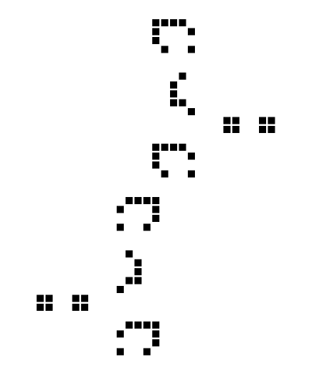
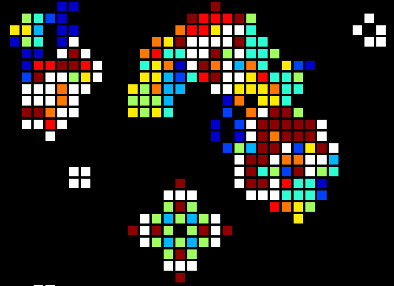

# Conway's Game of Life animations

### Two puffers in opposite direction (1150 Generations)

Generation #1 seed:

Animation
https://juan-domenech.github.io/sandbox/python/game-of-life/two-puffers-opposite-direction-1150generations.html

### Seed "Rabbits" animated with color palette (3000 Generations)

Animation: []
(http://juan-domenech.github.io/sandbox/python/game-of-life/rabbits-3000-generations.html)

http://juan-domenech.github.io/sandbox/python/game-of-life/rabbits-3000-generations.html

### Code

https://github.com/juan-domenech/game_of_life
